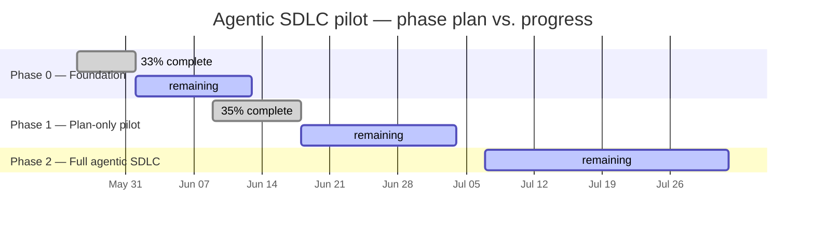
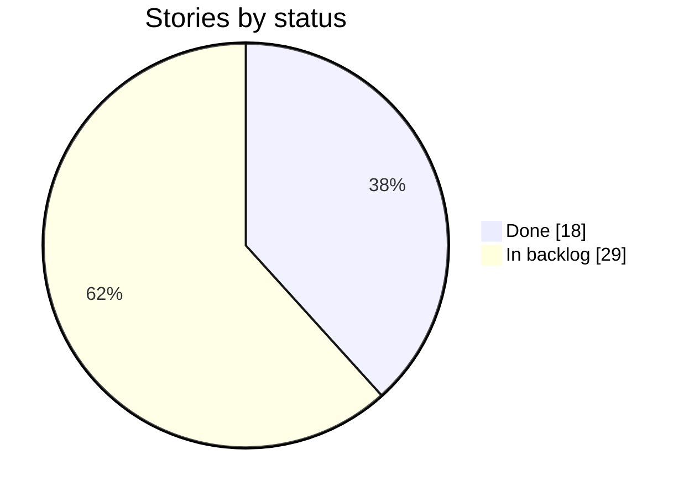

# 📊 Agentic SDLC Pilot — Delivery Dashboard

_Auto-generated from the [Issues](https://github.com/carloshumbertoreyesortiz/agentic-sdlc-pilot/issues) · last updated **2026-06-12 16:15 UTC**. Do not edit by hand — see `scripts/dashboard.ts`._

## Overall progress

**Stories:** 18 / 47 done

`██████████████░░░░░░░░░░░░░░░░░░░░░░` 38%

**Story points:** 50 / 154 delivered

`████████████░░░░░░░░░░░░░░░░░░░░░░░░` 32%

## 🗓️ Phase timeline

_Planned windows (vertical line = today). Edit dates in `PHASES` in `scripts/dashboard.ts`._

## Progress by phase

| Phase | Stories | Points | Progress |
| --- | --- | --- | --- |
| Phase 0 — Foundation | 5/15 | 9/27 | `██████░░░░░░░░░░░░` 33% |
| Phase 1 — Plan-only pilot | 13/28 | 41/116 | `██████░░░░░░░░░░░░` 35% |
| Phase 2 — Full agentic SDLC | 0/4 | 0/11 | `░░░░░░░░░░░░░░░░░░` 0% |

## Status distribution

## Progress by epic

| Epic | Stories | Points | Progress |
| --- | --- | --- | --- |
| [E-01: Engineer Workstation Foundation](https://github.com/carloshumbertoreyesortiz/agentic-sdlc-pilot/issues/1) | 0/5 | 0/7 | `░░░░░░░░░░░░░░░░░░` 0% |
| [E-02: Agent Runtime Provisioning](https://github.com/carloshumbertoreyesortiz/agentic-sdlc-pilot/issues/2) | 3/6 | 5/11 | `████████░░░░░░░░░░` 45% |
| [E-03: Pilot Repository Scaffold](https://github.com/carloshumbertoreyesortiz/agentic-sdlc-pilot/issues/3) | 5/5 | 10/10 | `██████████████████` 100% |
| [E-04: Git Foundation & Branch Protection](https://github.com/carloshumbertoreyesortiz/agentic-sdlc-pilot/issues/4) | 2/4 | 4/9 | `████████░░░░░░░░░░` 44% |
| [E-05: First Planner Agent Loop](https://github.com/carloshumbertoreyesortiz/agentic-sdlc-pilot/issues/5) | 2/4 | 13/24 | `██████████░░░░░░░░` 54% |
| [E-06: MCP Server Ecosystem](https://github.com/carloshumbertoreyesortiz/agentic-sdlc-pilot/issues/6) | 1/4 | 1/7 | `███░░░░░░░░░░░░░░░` 14% |
| [E-07: Provenance & Compliance Workflow](https://github.com/carloshumbertoreyesortiz/agentic-sdlc-pilot/issues/7) | 5/5 | 17/17 | `██████████████████` 100% |
| [E-08: Browser Verification (Playwright)](https://github.com/carloshumbertoreyesortiz/agentic-sdlc-pilot/issues/8) | 0/4 | 0/11 | `░░░░░░░░░░░░░░░░░░` 0% |
| [E-09: Slack Intake Bot](https://github.com/carloshumbertoreyesortiz/agentic-sdlc-pilot/issues/9) | 0/6 | 0/34 | `░░░░░░░░░░░░░░░░░░` 0% |
| [E-10: Phase 0/1 Smoke Test & Pilot Launch](https://github.com/carloshumbertoreyesortiz/agentic-sdlc-pilot/issues/10) | 0/4 | 0/24 | `░░░░░░░░░░░░░░░░░░` 0% |

## 🚧 In flight

_No open `agent/*` pull requests right now._

## ✅ Recently shipped

- `2026-06-11` [US-022: Build headless planner script via Anthropic SDK](https://github.com/carloshumbertoreyesortiz/agentic-sdlc-pilot/issues/32)
- `2026-06-11` [US-011: Validate both runtimes with smoke tests](https://github.com/carloshumbertoreyesortiz/agentic-sdlc-pilot/issues/21)
- `2026-06-11` [US-010: Secure ANTHROPIC_API_KEY in macOS Keychain](https://github.com/carloshumbertoreyesortiz/agentic-sdlc-pilot/issues/20)
- `2026-06-11` [US-006: Provision Anthropic Console accounts on Telenor billing](https://github.com/carloshumbertoreyesortiz/agentic-sdlc-pilot/issues/16)
- `2026-06-10` [US-025: Install filesystem MCP server](https://github.com/carloshumbertoreyesortiz/agentic-sdlc-pilot/issues/35)
- `2026-06-10` [US-030: Implement provenance writer in custom agent](https://github.com/carloshumbertoreyesortiz/agentic-sdlc-pilot/issues/40)
- `2026-06-10` [US-021: Drive first end-to-end /plan run against the CSV-escape seed task](https://github.com/carloshumbertoreyesortiz/agentic-sdlc-pilot/issues/31)
- `2026-06-10` [US-033: Validate by attempting a no-provenance merge (negative test)](https://github.com/carloshumbertoreyesortiz/agentic-sdlc-pilot/issues/43)
