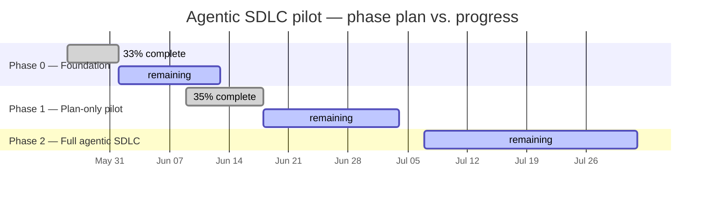
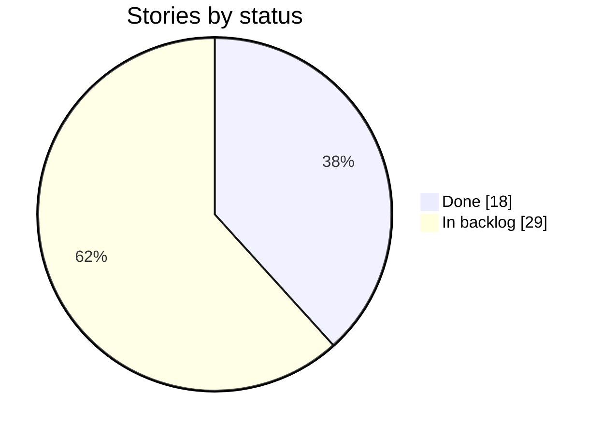

# 📊 Agentic SDLC Pilot — Delivery Dashboard

_Auto-generated from the [Issues](https://github.com/carloshumbertoreyesortiz/agentic-sdlc-pilot/issues) · last updated **2026-06-12 16:36 UTC**. Do not edit by hand — see `scripts/dashboard.ts`._

## Overall progress

**Stories:** 18 / 47 done

`██████████████░░░░░░░░░░░░░░░░░░░░░░` 38%

**Story points:** 50 / 154 delivered

`████████████░░░░░░░░░░░░░░░░░░░░░░░░` 32%

## 🗓️ Phase timeline

_Planned windows (vertical line = today). Edit dates in `PHASES` in `scripts/dashboard.ts`._

## Progress by phase

| Phase | Stories | Points | Progress |
| --- | --- | --- | --- |
| Phase 0 — Foundation | 5/15 | 9/27 | `██████░░░░░░░░░░░░` 33% |
| Phase 1 — Plan-only pilot | 13/28 | 41/116 | `██████░░░░░░░░░░░░` 35% |
| Phase 2 — Full agentic SDLC | 0/4 | 0/11 | `░░░░░░░░░░░░░░░░░░` 0% |

## Status distribution

## Progress by epic

| Epic | Stories | Points | Progress |
| --- | --- | --- | --- |
| [E-01: Engineer Workstation Foundation](https://github.com/carloshumbertoreyesortiz/agentic-sdlc-pilot/issues/1) | 0/5 | 0/7 | `░░░░░░░░░░░░░░░░░░` 0% |
| [E-02: Agent Runtime Provisioning](https://github.com/carloshumbertoreyesortiz/agentic-sdlc-pilot/issues/2) | 3/6 | 5/11 | `████████░░░░░░░░░░` 45% |
| [E-03: Pilot Repository Scaffold](https://github.com/carloshumbertoreyesortiz/agentic-sdlc-pilot/issues/3) | 5/5 | 10/10 | `██████████████████` 100% |
| [E-04: Git Foundation & Branch Protection](https://github.com/carloshumbertoreyesortiz/agentic-sdlc-pilot/issues/4) | 2/4 | 4/9 | `████████░░░░░░░░░░` 44% |
| [E-05: First Planner Agent Loop](https://github.com/carloshumbertoreyesortiz/agentic-sdlc-pilot/issues/5) | 2/4 | 13/24 | `██████████░░░░░░░░` 54% |
| [E-06: MCP Server Ecosystem](https://github.com/carloshumbertoreyesortiz/agentic-sdlc-pilot/issues/6) | 1/4 | 1/7 | `███░░░░░░░░░░░░░░░` 14% |
| [E-07: Provenance & Compliance Workflow](https://github.com/carloshumbertoreyesortiz/agentic-sdlc-pilot/issues/7) | 5/5 | 17/17 | `██████████████████` 100% |
| [E-08: Browser Verification (Playwright)](https://github.com/carloshumbertoreyesortiz/agentic-sdlc-pilot/issues/8) | 0/4 | 0/11 | `░░░░░░░░░░░░░░░░░░` 0% |
| [E-09: Slack Intake Bot](https://github.com/carloshumbertoreyesortiz/agentic-sdlc-pilot/issues/9) | 0/6 | 0/34 | `░░░░░░░░░░░░░░░░░░` 0% |
| [E-10: Phase 0/1 Smoke Test & Pilot Launch](https://github.com/carloshumbertoreyesortiz/agentic-sdlc-pilot/issues/10) | 0/4 | 0/24 | `░░░░░░░░░░░░░░░░░░` 0% |

### Stories by epic

_Click an epic to expand its stories._

<strong>E-01: Engineer Workstation Foundation</strong> — 0/5 done

| Story | Title | Status |
| --- | --- | --- |
| [US-001](https://github.com/carloshumbertoreyesortiz/agentic-sdlc-pilot/issues/11) | Install Homebrew on engineer Macs | ⚪ To do |
| [US-002](https://github.com/carloshumbertoreyesortiz/agentic-sdlc-pilot/issues/12) | Install core dev tools (git, node, python, gh, jq) | ⚪ To do |
| [US-003](https://github.com/carloshumbertoreyesortiz/agentic-sdlc-pilot/issues/13) | Configure Git identity and SSH key for GitHub | ⚪ To do |
| [US-004](https://github.com/carloshumbertoreyesortiz/agentic-sdlc-pilot/issues/14) | Install VS Code with Telenor extension set | ⚪ To do |
| [US-005](https://github.com/carloshumbertoreyesortiz/agentic-sdlc-pilot/issues/15) | Apply shared VS Code user settings | ⚪ To do |

<strong>E-02: Agent Runtime Provisioning</strong> — 3/6 done

| Story | Title | Status |
| --- | --- | --- |
| [US-006](https://github.com/carloshumbertoreyesortiz/agentic-sdlc-pilot/issues/16) | Provision Anthropic Console accounts on Telenor billing | ✅ Done |
| [US-007](https://github.com/carloshumbertoreyesortiz/agentic-sdlc-pilot/issues/17) | Verify each engineer's Claude subscription tier | ⚪ To do |
| [US-008](https://github.com/carloshumbertoreyesortiz/agentic-sdlc-pilot/issues/18) | Install Claude Code on engineer workstations | ⚪ To do |
| [US-009](https://github.com/carloshumbertoreyesortiz/agentic-sdlc-pilot/issues/19) | (Optional) Install Antigravity 2.0 desktop + agy CLI | 🟧 Blocked |
| [US-010](https://github.com/carloshumbertoreyesortiz/agentic-sdlc-pilot/issues/20) | Secure ANTHROPIC_API_KEY in macOS Keychain | ✅ Done |
| [US-011](https://github.com/carloshumbertoreyesortiz/agentic-sdlc-pilot/issues/21) | Validate both runtimes with smoke tests | ✅ Done |

<strong>E-03: Pilot Repository Scaffold</strong> — 5/5 done

| Story | Title | Status |
| --- | --- | --- |
| [US-012](https://github.com/carloshumbertoreyesortiz/agentic-sdlc-pilot/issues/22) | Create agentic-sdlc-pilot GitHub repo under Telenor org | ✅ Done |
| [US-013](https://github.com/carloshumbertoreyesortiz/agentic-sdlc-pilot/issues/23) | Author CLAUDE.md per Telenor conventions | ✅ Done |
| [US-014](https://github.com/carloshumbertoreyesortiz/agentic-sdlc-pilot/issues/24) | Configure .gitignore with secrets exclusions | ✅ Done |
| [US-015](https://github.com/carloshumbertoreyesortiz/agentic-sdlc-pilot/issues/25) | Initialize package.json with npm scripts | ✅ Done |
| [US-016](https://github.com/carloshumbertoreyesortiz/agentic-sdlc-pilot/issues/26) | Author /plan custom slash command in .claude/commands/ | ✅ Done |

<strong>E-04: Git Foundation & Branch Protection</strong> — 2/4 done

| Story | Title | Status |
| --- | --- | --- |
| [US-017](https://github.com/carloshumbertoreyesortiz/agentic-sdlc-pilot/issues/27) | Authenticate gh CLI for the pilot squad | ⚪ To do |
| [US-018](https://github.com/carloshumbertoreyesortiz/agentic-sdlc-pilot/issues/28) | Configure branch protection on main | ✅ Done |
| [US-019](https://github.com/carloshumbertoreyesortiz/agentic-sdlc-pilot/issues/29) | Document and enforce agent/* branch naming convention | ✅ Done |
| [US-020](https://github.com/carloshumbertoreyesortiz/agentic-sdlc-pilot/issues/30) | Create fine-grained GH_AGENT_TOKEN for MCP | ⚪ To do |

<strong>E-05: First Planner Agent Loop</strong> — 2/4 done

| Story | Title | Status |
| --- | --- | --- |
| [US-021](https://github.com/carloshumbertoreyesortiz/agentic-sdlc-pilot/issues/31) | Drive first end-to-end /plan run against the CSV-escape seed task | ✅ Done |
| [US-022](https://github.com/carloshumbertoreyesortiz/agentic-sdlc-pilot/issues/32) | Build headless planner script via Anthropic SDK | ✅ Done |
| [US-023](https://github.com/carloshumbertoreyesortiz/agentic-sdlc-pilot/issues/33) | Implement untrusted-input tagging in planner system prompt | ⚪ To do |
| [US-024](https://github.com/carloshumbertoreyesortiz/agentic-sdlc-pilot/issues/34) | Run 3 pilot tuning cycles and capture metrics | ⚪ To do |

<strong>E-06: MCP Server Ecosystem</strong> — 1/4 done

| Story | Title | Status |
| --- | --- | --- |
| [US-025](https://github.com/carloshumbertoreyesortiz/agentic-sdlc-pilot/issues/35) | Install filesystem MCP server | ✅ Done |
| [US-026](https://github.com/carloshumbertoreyesortiz/agentic-sdlc-pilot/issues/36) | Install GitHub MCP server with fine-grained PAT | ⚪ To do |
| [US-027](https://github.com/carloshumbertoreyesortiz/agentic-sdlc-pilot/issues/37) | Configure project-scoped .claude/mcp.json | ⚪ To do |
| [US-028](https://github.com/carloshumbertoreyesortiz/agentic-sdlc-pilot/issues/38) | Verify MCP integration end-to-end | ⚪ To do |

<strong>E-07: Provenance & Compliance Workflow</strong> — 5/5 done

| Story | Title | Status |
| --- | --- | --- |
| [US-029](https://github.com/carloshumbertoreyesortiz/agentic-sdlc-pilot/issues/39) | Design .agent/provenance.json schema | ✅ Done |
| [US-030](https://github.com/carloshumbertoreyesortiz/agentic-sdlc-pilot/issues/40) | Implement provenance writer in custom agent | ✅ Done |
| [US-031](https://github.com/carloshumbertoreyesortiz/agentic-sdlc-pilot/issues/41) | Build GitHub Actions agent-provenance workflow | ✅ Done |
| [US-032](https://github.com/carloshumbertoreyesortiz/agentic-sdlc-pilot/issues/42) | Wire agent-provenance as required status check on main | ✅ Done |
| [US-033](https://github.com/carloshumbertoreyesortiz/agentic-sdlc-pilot/issues/43) | Validate by attempting a no-provenance merge (negative test) | ✅ Done |

<strong>E-08: Browser Verification (Playwright)</strong> — 0/4 done

| Story | Title | Status |
| --- | --- | --- |
| [US-034](https://github.com/carloshumbertoreyesortiz/agentic-sdlc-pilot/issues/44) | Install Playwright + Chromium | ⚪ To do |
| [US-035](https://github.com/carloshumbertoreyesortiz/agentic-sdlc-pilot/issues/45) | Author baseline visual regression test | ⚪ To do |
| [US-036](https://github.com/carloshumbertoreyesortiz/agentic-sdlc-pilot/issues/46) | Build run-visual tool for the agent loop | ⚪ To do |
| [US-037](https://github.com/carloshumbertoreyesortiz/agentic-sdlc-pilot/issues/47) | (Optional) Install Playwright MCP server | ⚪ To do |

<strong>E-09: Slack Intake Bot</strong> — 0/6 done

| Story | Title | Status |
| --- | --- | --- |
| [US-038](https://github.com/carloshumbertoreyesortiz/agentic-sdlc-pilot/issues/48) | Register Slack app in Telenor workspace with required scopes | ⚪ To do |
| [US-039](https://github.com/carloshumbertoreyesortiz/agentic-sdlc-pilot/issues/49) | Build bot scaffold with read-only first run | ⚪ To do |
| [US-040](https://github.com/carloshumbertoreyesortiz/agentic-sdlc-pilot/issues/50) | Implement intake handler with attachment hashing | ⚪ To do |
| [US-041](https://github.com/carloshumbertoreyesortiz/agentic-sdlc-pilot/issues/51) | Implement Checkpoint 1 (plan approval) Block Kit flow | ⚪ To do |
| [US-042](https://github.com/carloshumbertoreyesortiz/agentic-sdlc-pilot/issues/52) | Implement Checkpoint 2 (PR review) DM flow | ⚪ To do |
| [US-043](https://github.com/carloshumbertoreyesortiz/agentic-sdlc-pilot/issues/53) | Implement Checkpoint 3 (deploy approval) flow | ⚪ To do |

<strong>E-10: Phase 0/1 Smoke Test & Pilot Launch</strong> — 0/4 done

| Story | Title | Status |
| --- | --- | --- |
| [US-044](https://github.com/carloshumbertoreyesortiz/agentic-sdlc-pilot/issues/54) | Run end-to-end smoke test per impl guide §13 | ⚪ To do |
| [US-045](https://github.com/carloshumbertoreyesortiz/agentic-sdlc-pilot/issues/55) | Stand up metrics dashboard with 6 baseline metrics | ⚪ To do |
| [US-046](https://github.com/carloshumbertoreyesortiz/agentic-sdlc-pilot/issues/56) | Run 2-week pilot with one squad, collect feedback | ⚪ To do |
| [US-047](https://github.com/carloshumbertoreyesortiz/agentic-sdlc-pilot/issues/57) | Governance council Phase 0/1 sign-off review | ⚪ To do |

## 🚧 In flight

- [#70](https://github.com/carloshumbertoreyesortiz/agentic-sdlc-pilot/pull/70) feat(dashboard): self-updating delivery dashboard (US-045) — `agent/us045-delivery-dashboard`

## ✅ Recently shipped

- `2026-06-11` [US-022: Build headless planner script via Anthropic SDK](https://github.com/carloshumbertoreyesortiz/agentic-sdlc-pilot/issues/32)
- `2026-06-11` [US-011: Validate both runtimes with smoke tests](https://github.com/carloshumbertoreyesortiz/agentic-sdlc-pilot/issues/21)
- `2026-06-11` [US-010: Secure ANTHROPIC_API_KEY in macOS Keychain](https://github.com/carloshumbertoreyesortiz/agentic-sdlc-pilot/issues/20)
- `2026-06-11` [US-006: Provision Anthropic Console accounts on Telenor billing](https://github.com/carloshumbertoreyesortiz/agentic-sdlc-pilot/issues/16)
- `2026-06-10` [US-025: Install filesystem MCP server](https://github.com/carloshumbertoreyesortiz/agentic-sdlc-pilot/issues/35)
- `2026-06-10` [US-030: Implement provenance writer in custom agent](https://github.com/carloshumbertoreyesortiz/agentic-sdlc-pilot/issues/40)
- `2026-06-10` [US-021: Drive first end-to-end /plan run against the CSV-escape seed task](https://github.com/carloshumbertoreyesortiz/agentic-sdlc-pilot/issues/31)
- `2026-06-10` [US-033: Validate by attempting a no-provenance merge (negative test)](https://github.com/carloshumbertoreyesortiz/agentic-sdlc-pilot/issues/43)

## ⚠️ Risk register

_Source: [docs/risks.md](docs/risks.md)._

| ID | Severity | Status |
| --- | --- | --- |
| R-01 | Medium | Accepted (Phase 0/1) |
| R-02 | High | Accepted (Phase 0/1) |
| R-03 | Low | Resolved 2026-06-11 |
