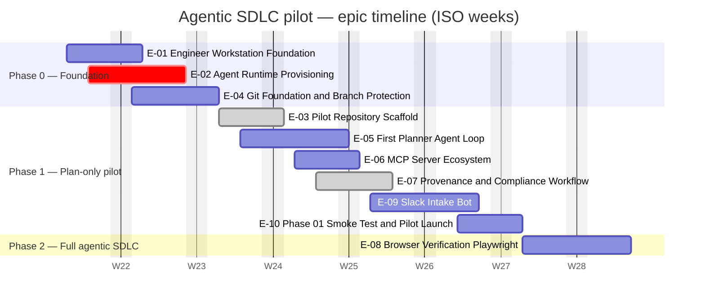
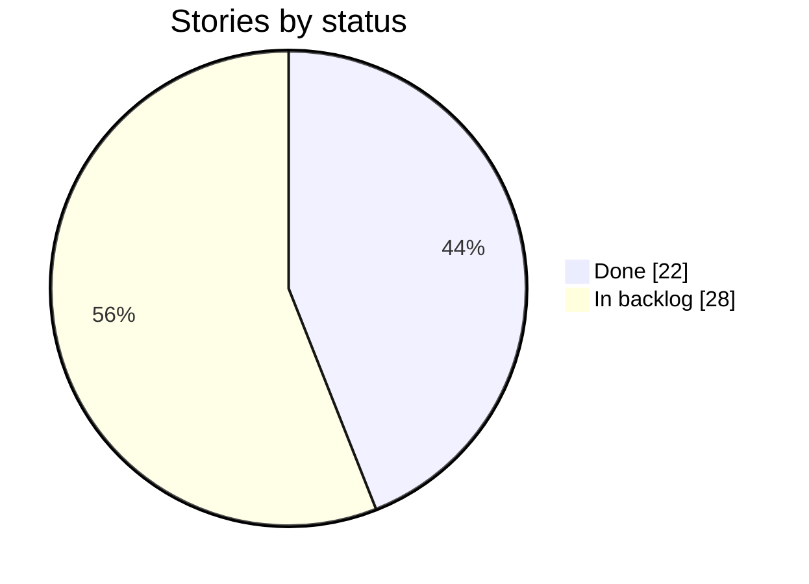

# 📊 Agentic SDLC Pilot — Delivery Dashboard

_Auto-generated from the [Issues](https://github.com/carloshumbertoreyesortiz/agentic-sdlc-pilot/issues) · last updated **2026-06-16 11:33 UTC**. Do not edit by hand — see `scripts/dashboard.ts`._

## Overall progress

**Stories:** 22 / 50 done

`████████████████░░░░░░░░░░░░░░░░░░░░` 44%

**Story points:** 60 / 159 delivered

`██████████████░░░░░░░░░░░░░░░░░░░░░░` 38%

## 📊 KPIs

| Total | ✅ Done | 🟧 Blocked | 🟨 In Progress | ⚪ To Do | 🎯 % | 📅 Week |
| --- | --- | --- | --- | --- | --- | --- |
| ## 50 | ## 22 | ## 1 | ## 0 | ## 27 | ## 44% | ## W25 |

> **Velocity** — Today is W25 (Jun 15–Jun 21). 22 of 50 stories closed in W19–W25. Projected completion at current pace: ~W34. Critical path: US-009 (unassigned).

## 🗓️ Epic timeline

_Bars are epics; axis in ISO weeks (`W%V`), weekends excluded. Colour = aggregate story state: `done` · `active` (in progress) · `crit` (blocked) · plain (planned). A milestone `due_on` overrides the planned end (else `EPIC_DATES`)._

### Weekly activity

| Week | Opened | Closed | Net | Notable |
| --- | --- | --- | --- | --- |
| W19 (May 04–May 10) | 0 | 0 | +0 | — |
| W20 (May 11–May 17) | 0 | 0 | +0 | — |
| W21 (May 18–May 24) | 0 | 0 | +0 | — |
| W22 (May 25–May 31) | 0 | 0 | +0 | — |
| W23 (Jun 01–Jun 07) | 0 | 0 | +0 | — |
| W24 (Jun 08–Jun 14) | 59 | 21 | -38 | #75 ci(dashboard): refresh on schedule + dispatch only, drop issue triggers (US-049) |
| W25 (Jun 15–Jun 21) | 1 | 1 | +0 | #80 fix(pages): cohesive dark theme — graphical bars, readable chips, large KPIs |

_W24 spike: full backlog of 58 issues seeded this week (2026-06-09). True post-seeding velocity will show from W25 onward._

## Progress by phase

| Phase | Stories | Points | Progress |
| --- | --- | --- | --- |
| Phase 0 — Foundation | 5/15 | 9/27 | `██████░░░░░░░░░░░░` 33% |
| Phase 1 — Plan-only pilot | 17/31 | 51/121 | `████████░░░░░░░░░░` 42% |
| Phase 2 — Full agentic SDLC | 0/4 | 0/11 | `░░░░░░░░░░░░░░░░░░` 0% |

## Status distribution

## Progress by epic

| Epic | Stories | Points | Progress |
| --- | --- | --- | --- |
| [E-01: Engineer Workstation Foundation](https://github.com/carloshumbertoreyesortiz/agentic-sdlc-pilot/issues/1) | 0/5 | 0/7 | `░░░░░░░░░░░░░░░░░░` 0% |
| [E-02: Agent Runtime Provisioning](https://github.com/carloshumbertoreyesortiz/agentic-sdlc-pilot/issues/2) | 3/6 | 5/11 | `████████░░░░░░░░░░` 45% |
| [E-03: Pilot Repository Scaffold](https://github.com/carloshumbertoreyesortiz/agentic-sdlc-pilot/issues/3) | 5/5 | 10/10 | `██████████████████` 100% |
| [E-04: Git Foundation & Branch Protection](https://github.com/carloshumbertoreyesortiz/agentic-sdlc-pilot/issues/4) | 2/4 | 4/9 | `████████░░░░░░░░░░` 44% |
| [E-05: First Planner Agent Loop](https://github.com/carloshumbertoreyesortiz/agentic-sdlc-pilot/issues/5) | 2/4 | 13/24 | `██████████░░░░░░░░` 54% |
| [E-06: MCP Server Ecosystem](https://github.com/carloshumbertoreyesortiz/agentic-sdlc-pilot/issues/6) | 1/4 | 1/7 | `███░░░░░░░░░░░░░░░` 14% |
| [E-07: Provenance & Compliance Workflow](https://github.com/carloshumbertoreyesortiz/agentic-sdlc-pilot/issues/7) | 5/5 | 17/17 | `██████████████████` 100% |
| [E-08: Browser Verification (Playwright)](https://github.com/carloshumbertoreyesortiz/agentic-sdlc-pilot/issues/8) | 0/4 | 0/11 | `░░░░░░░░░░░░░░░░░░` 0% |
| [E-09: Slack Intake Bot](https://github.com/carloshumbertoreyesortiz/agentic-sdlc-pilot/issues/9) | 0/6 | 0/34 | `░░░░░░░░░░░░░░░░░░` 0% |
| [E-10: Phase 0/1 Smoke Test & Pilot Launch](https://github.com/carloshumbertoreyesortiz/agentic-sdlc-pilot/issues/10) | 4/7 | 10/29 | `██████░░░░░░░░░░░░` 34% |

### Stories by epic

_Click an epic to expand its stories._

<strong>E-01: Engineer Workstation Foundation</strong> — 0/5 done

| Story | Title | Status | Est. Week | Blocks |
| --- | --- | --- | --- | --- |
| [US-001](https://github.com/carloshumbertoreyesortiz/agentic-sdlc-pilot/issues/11) | Install Homebrew on engineer Macs | ⚪ To do | W22 | US-002, US-004, US-008, US-009 |
| [US-002](https://github.com/carloshumbertoreyesortiz/agentic-sdlc-pilot/issues/12) | Install core dev tools (git, node, python, gh, jq) | ⚪ To do | W22 | US-003, US-008, US-015, US-025 |
| [US-003](https://github.com/carloshumbertoreyesortiz/agentic-sdlc-pilot/issues/13) | Configure Git identity and SSH key for GitHub | ⚪ To do | W22 | US-012, US-017 |
| [US-004](https://github.com/carloshumbertoreyesortiz/agentic-sdlc-pilot/issues/14) | Install VS Code with Telenor extension set | ⚪ To do | W22 | US-005 |
| [US-005](https://github.com/carloshumbertoreyesortiz/agentic-sdlc-pilot/issues/15) | Apply shared VS Code user settings | ⚪ To do | W23 | — |

<strong>E-02: Agent Runtime Provisioning</strong> — 3/6 done

| Story | Title | Status | Est. Week | Blocks |
| --- | --- | --- | --- | --- |
| [US-006](https://github.com/carloshumbertoreyesortiz/agentic-sdlc-pilot/issues/16) | Provision Anthropic Console accounts on Telenor billing | ✅ Done | W22 | US-010 |
| [US-007](https://github.com/carloshumbertoreyesortiz/agentic-sdlc-pilot/issues/17) | Verify each engineer's Claude subscription tier | ⚪ To do | W22 | US-008 |
| [US-008](https://github.com/carloshumbertoreyesortiz/agentic-sdlc-pilot/issues/18) | Install Claude Code on engineer workstations | ⚪ To do | W22 | US-011, US-021 |
| [US-009](https://github.com/carloshumbertoreyesortiz/agentic-sdlc-pilot/issues/19) | (Optional) Install Antigravity 2.0 desktop + agy CLI | 🟧 Blocked | W23 | — |
| [US-010](https://github.com/carloshumbertoreyesortiz/agentic-sdlc-pilot/issues/20) | Secure ANTHROPIC_API_KEY in macOS Keychain | ✅ Done | W23 | US-011 |
| [US-011](https://github.com/carloshumbertoreyesortiz/agentic-sdlc-pilot/issues/21) | Validate both runtimes with smoke tests | ✅ Done | W23 | — |

<strong>E-03: Pilot Repository Scaffold</strong> — 5/5 done

| Story | Title | Status | Est. Week | Blocks |
| --- | --- | --- | --- | --- |
| [US-012](https://github.com/carloshumbertoreyesortiz/agentic-sdlc-pilot/issues/22) | Create agentic-sdlc-pilot GitHub repo under Telenor org | ✅ Done | W24 | US-013, US-014, US-015, US-018 |
| [US-013](https://github.com/carloshumbertoreyesortiz/agentic-sdlc-pilot/issues/23) | Author CLAUDE.md per Telenor conventions | ✅ Done | W24 | US-016, US-019, US-022, US-029 |
| [US-014](https://github.com/carloshumbertoreyesortiz/agentic-sdlc-pilot/issues/24) | Configure .gitignore with secrets exclusions | ✅ Done | W24 | — |
| [US-015](https://github.com/carloshumbertoreyesortiz/agentic-sdlc-pilot/issues/25) | Initialize package.json with npm scripts | ✅ Done | W24 | US-022, US-034 |
| [US-016](https://github.com/carloshumbertoreyesortiz/agentic-sdlc-pilot/issues/26) | Author /plan custom slash command in .claude/commands/ | ✅ Done | W24 | US-021 |

<strong>E-04: Git Foundation & Branch Protection</strong> — 2/4 done

| Story | Title | Status | Est. Week | Blocks |
| --- | --- | --- | --- | --- |
| [US-017](https://github.com/carloshumbertoreyesortiz/agentic-sdlc-pilot/issues/27) | Authenticate gh CLI for the pilot squad | ⚪ To do | W23 | US-018 |
| [US-018](https://github.com/carloshumbertoreyesortiz/agentic-sdlc-pilot/issues/28) | Configure branch protection on main | ✅ Done | W23 | US-020, US-032 |
| [US-019](https://github.com/carloshumbertoreyesortiz/agentic-sdlc-pilot/issues/29) | Document and enforce agent/* branch naming convention | ✅ Done | W23 | — |
| [US-020](https://github.com/carloshumbertoreyesortiz/agentic-sdlc-pilot/issues/30) | Create fine-grained GH_AGENT_TOKEN for MCP | ⚪ To do | W23 | US-026 |

<strong>E-05: First Planner Agent Loop</strong> — 2/4 done

| Story | Title | Status | Est. Week | Blocks |
| --- | --- | --- | --- | --- |
| [US-021](https://github.com/carloshumbertoreyesortiz/agentic-sdlc-pilot/issues/31) | Drive first end-to-end /plan run against the CSV-escape seed task | ✅ Done | W24 | US-024, US-041 |
| [US-022](https://github.com/carloshumbertoreyesortiz/agentic-sdlc-pilot/issues/32) | Build headless planner script via Anthropic SDK | ✅ Done | W24 | US-023, US-024, US-030 |
| [US-023](https://github.com/carloshumbertoreyesortiz/agentic-sdlc-pilot/issues/33) | Implement untrusted-input tagging in planner system prompt | ⚪ To do | W25 | US-040 |
| [US-024](https://github.com/carloshumbertoreyesortiz/agentic-sdlc-pilot/issues/34) | Run 3 pilot tuning cycles and capture metrics | ⚪ To do | W25 | US-044, US-045 |

<strong>E-06: MCP Server Ecosystem</strong> — 1/4 done

| Story | Title | Status | Est. Week | Blocks |
| --- | --- | --- | --- | --- |
| [US-025](https://github.com/carloshumbertoreyesortiz/agentic-sdlc-pilot/issues/35) | Install filesystem MCP server | ✅ Done | W25 | US-026 |
| [US-026](https://github.com/carloshumbertoreyesortiz/agentic-sdlc-pilot/issues/36) | Install GitHub MCP server with fine-grained PAT | ⚪ To do | W25 | US-027 |
| [US-027](https://github.com/carloshumbertoreyesortiz/agentic-sdlc-pilot/issues/37) | Configure project-scoped .claude/mcp.json | ⚪ To do | W25 | US-028, US-037 |
| [US-028](https://github.com/carloshumbertoreyesortiz/agentic-sdlc-pilot/issues/38) | Verify MCP integration end-to-end | ⚪ To do | W25 | — |

<strong>E-07: Provenance & Compliance Workflow</strong> — 5/5 done

| Story | Title | Status | Est. Week | Blocks |
| --- | --- | --- | --- | --- |
| [US-029](https://github.com/carloshumbertoreyesortiz/agentic-sdlc-pilot/issues/39) | Design .agent/provenance.json schema | ✅ Done | W25 | US-030, US-031 |
| [US-030](https://github.com/carloshumbertoreyesortiz/agentic-sdlc-pilot/issues/40) | Implement provenance writer in custom agent | ✅ Done | W25 | — |
| [US-031](https://github.com/carloshumbertoreyesortiz/agentic-sdlc-pilot/issues/41) | Build GitHub Actions agent-provenance workflow | ✅ Done | W25 | US-032 |
| [US-032](https://github.com/carloshumbertoreyesortiz/agentic-sdlc-pilot/issues/42) | Wire agent-provenance as required status check on main | ✅ Done | W26 | US-033 |
| [US-033](https://github.com/carloshumbertoreyesortiz/agentic-sdlc-pilot/issues/43) | Validate by attempting a no-provenance merge (negative test) | ✅ Done | W26 | US-044 |

<strong>E-08: Browser Verification (Playwright)</strong> — 0/4 done

| Story | Title | Status | Est. Week | Blocks |
| --- | --- | --- | --- | --- |
| [US-034](https://github.com/carloshumbertoreyesortiz/agentic-sdlc-pilot/issues/44) | Install Playwright + Chromium | ⚪ To do | W28 | US-035, US-037 |
| [US-035](https://github.com/carloshumbertoreyesortiz/agentic-sdlc-pilot/issues/45) | Author baseline visual regression test | ⚪ To do | W28 | US-036 |
| [US-036](https://github.com/carloshumbertoreyesortiz/agentic-sdlc-pilot/issues/46) | Build run-visual tool for the agent loop | ⚪ To do | W28 | — |
| [US-037](https://github.com/carloshumbertoreyesortiz/agentic-sdlc-pilot/issues/47) | (Optional) Install Playwright MCP server | ⚪ To do | W29 | — |

<strong>E-09: Slack Intake Bot</strong> — 0/6 done

| Story | Title | Status | Est. Week | Blocks |
| --- | --- | --- | --- | --- |
| [US-038](https://github.com/carloshumbertoreyesortiz/agentic-sdlc-pilot/issues/48) | Register Slack app in Telenor workspace with required scopes | ⚪ To do | W26 | US-039 |
| [US-039](https://github.com/carloshumbertoreyesortiz/agentic-sdlc-pilot/issues/49) | Build bot scaffold with read-only first run | ⚪ To do | W26 | US-040 |
| [US-040](https://github.com/carloshumbertoreyesortiz/agentic-sdlc-pilot/issues/50) | Implement intake handler with attachment hashing | ⚪ To do | W26 | US-041 |
| [US-041](https://github.com/carloshumbertoreyesortiz/agentic-sdlc-pilot/issues/51) | Implement Checkpoint 1 (plan approval) Block Kit flow | ⚪ To do | W26 | US-042 |
| [US-042](https://github.com/carloshumbertoreyesortiz/agentic-sdlc-pilot/issues/52) | Implement Checkpoint 2 (PR review) DM flow | ⚪ To do | W27 | US-043 |
| [US-043](https://github.com/carloshumbertoreyesortiz/agentic-sdlc-pilot/issues/53) | Implement Checkpoint 3 (deploy approval) flow | ⚪ To do | W27 | US-044 |

<strong>E-10: Phase 0/1 Smoke Test & Pilot Launch</strong> — 4/7 done

| Story | Title | Status | Est. Week | Blocks |
| --- | --- | --- | --- | --- |
| [US-044](https://github.com/carloshumbertoreyesortiz/agentic-sdlc-pilot/issues/54) | Run end-to-end smoke test per impl guide §13 | ⚪ To do | W27 | US-046 |
| [US-045](https://github.com/carloshumbertoreyesortiz/agentic-sdlc-pilot/issues/55) | Stand up metrics dashboard with 6 baseline metrics | ✅ Done | W27 | US-046, US-048, US-049 |
| [US-046](https://github.com/carloshumbertoreyesortiz/agentic-sdlc-pilot/issues/56) | Run 2-week pilot with one squad, collect feedback | ⚪ To do | W27 | US-047 |
| [US-047](https://github.com/carloshumbertoreyesortiz/agentic-sdlc-pilot/issues/57) | Governance council Phase 0/1 sign-off review | ⚪ To do | W27 | — |
| [US-048](https://github.com/carloshumbertoreyesortiz/agentic-sdlc-pilot/issues/71) | KPI dashboard v2 — epic timelines, week numbers, velocity, weekly activity | ✅ Done | W27 | US-050 |
| [US-049](https://github.com/carloshumbertoreyesortiz/agentic-sdlc-pilot/issues/74) | Dashboard auto-refresh — remove issue-event trigger to eliminate write race | ✅ Done | W27 | — |
| [US-050](https://github.com/carloshumbertoreyesortiz/agentic-sdlc-pilot/issues/76) | Publish dashboard as a GitHub Pages site | ✅ Done | W28 | — |

## 🚧 In flight

_No open `agent/*` pull requests right now._

## ✅ Recently shipped

- `2026-06-15` [US-050: Publish dashboard as a GitHub Pages site](https://github.com/carloshumbertoreyesortiz/agentic-sdlc-pilot/issues/76)
- `2026-06-12` [US-049: Dashboard auto-refresh — remove issue-event trigger to eliminate write race](https://github.com/carloshumbertoreyesortiz/agentic-sdlc-pilot/issues/74)
- `2026-06-12` [US-048: KPI dashboard v2 — epic timelines, week numbers, velocity, weekly activity](https://github.com/carloshumbertoreyesortiz/agentic-sdlc-pilot/issues/71)
- `2026-06-12` [US-045: Stand up metrics dashboard with 6 baseline metrics](https://github.com/carloshumbertoreyesortiz/agentic-sdlc-pilot/issues/55)
- `2026-06-11` [US-022: Build headless planner script via Anthropic SDK](https://github.com/carloshumbertoreyesortiz/agentic-sdlc-pilot/issues/32)
- `2026-06-11` [US-011: Validate both runtimes with smoke tests](https://github.com/carloshumbertoreyesortiz/agentic-sdlc-pilot/issues/21)
- `2026-06-11` [US-010: Secure ANTHROPIC_API_KEY in macOS Keychain](https://github.com/carloshumbertoreyesortiz/agentic-sdlc-pilot/issues/20)
- `2026-06-11` [US-006: Provision Anthropic Console accounts on Telenor billing](https://github.com/carloshumbertoreyesortiz/agentic-sdlc-pilot/issues/16)

## ⚠️ Risk register

_Source: [docs/risks.md](docs/risks.md)._

| ID | Severity | Status |
| --- | --- | --- |
| R-01 | Medium | Accepted (Phase 0/1) |
| R-02 | High | Accepted (Phase 0/1) |
| R-03 | Low | Resolved 2026-06-11 |
